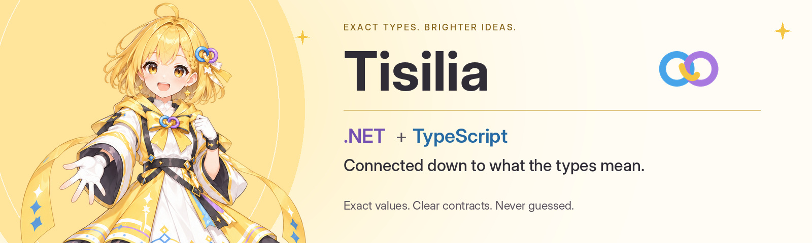

# Tisilia



[](https://www.nuget.org/packages/Kkdev92.Tisilia.AspNetCore)
[](https://www.npmjs.com/package/@kkdev92/tisilia-runtime)
[](https://github.com/kkdev92/tisilia/actions)
[](https://opensource.org/licenses/MIT)
[](https://dotnet.microsoft.com/)

.NET and TypeScript, connected down to what the types mean. Tisilia reads an ASP.NET Core API from the running
application — the endpoints it maps and the System.Text.Json options in effect for each — writes that down as a contract,
and generates a TypeScript client from it that reads and writes exactly the JSON the server does. A 64-bit integer stays an
integer, a decimal keeps its scale, a date keeps its offset, and what the contract cannot describe is reported, never
guessed.
_Built for teams that need consistent value semantics across .NET and TypeScript._

> **Status:** `0.2.0-alpha`, an unreleased compatibility update. On every CI run the packed packages are installed into a fresh ASP.NET
> Core application and a fresh TypeScript project: the CLI exports and validates the application's contract, generates a
> client, compiles it under strict settings, and calls the running application through it, and an int64 beyond 2^53 and a
> `+09:00` offset have to arrive exactly.
>
> The contract format is 0.4. The Codec ABI, portable codec DSL and conformance protocol remain 0.3. These are separate from the package version and
> may still change incompatibly before 1.0.0.

---

## Table of Contents

- [Features](#features)
- [Installation](#installation)
- [Quick Start](#quick-start)
- [Why Tisilia](#why-tisilia)
- [What Is Guaranteed](#what-is-guaranteed)
- [Known Limitations](#known-limitations)
- [How It Works](#how-it-works)
- [Platform Requirements](#platform-requirements)
- [Security and Privacy](#security-and-privacy)
- [Documentation](#documentation)
- [Contributing](#contributing)
- [Support & Maintenance Policy](#support--maintenance-policy)
- [License](#license)
- [Brand assets](#brand-assets)

---

## Features

- **A Contract From the Application Itself**: `tisilia export` builds and starts the application, records the endpoints it registered for Tisilia and the serializer options each one uses, and stops it again
- **Exact Values**: `long`, `ulong`, `decimal`, `Guid`, `DateOnly`, `TimeOnly`, `DateTimeOffset` and `TimeSpan` arrive as exact TypeScript values (bigint, scaled decimal, 100 ns ticks), never through a JavaScript `number` that cannot hold them
- **Types That Say What the Server Does**: nullability as the serializer writes it, enums by name or number, dictionaries with their key codecs, polymorphic types as tagged unions with literal discriminators, and one result type per declared response case
- **Fail Closed**: a converter without a binding, a `DateTime` whose kind is undeclared, a file download — anything the contract cannot describe exactly is a diagnostic with a fix, checked by 54 semantic rules (SV01–SV54)
- **Calls That Return, Not Throw**: a call gives a declared response case or a named failure — `unexpected-response`, `codec-failure`, `transport-failure`, `timeout`, `limit-failure`, `contract-mismatch` — and never follows a redirect
- **Custom Converters Included**: a hand-written `JsonConverter` is paired with a TypeScript codec module, or both sides are generated from a portable codec definition; the contract pins each module by its digest
- **Conformance You Can Show**: `tisilia conformance` runs a suite derived from the contract through the server's real converters and the generated client, and records the result as evidence that marks operations qualified
- **Explorer**: a page the application serves that runs every call through the generated client's own codecs — request and response side by side, an Authorize dialog, the API's own documentation, Japanese and English
- **Nuxt**: request-scoped clients, allowlisted header forwarding during SSR, and hydration envelopes that carry exact values from the server render to the browser
- **The API's Own Words**: XML comments, summaries, descriptions, validation attributes and `[Obsolete]` reach the Explorer and the client's JSDoc
- **Zero Third-Party Runtime Dependencies** in the .NET packages and in `@kkdev92/tisilia-runtime`

---

## Installation

```bash
# --prerelease, because every version so far is one and the CLI does not consider
# pre-release versions unless asked.
dotnet add package Kkdev92.Tisilia.AspNetCore --prerelease

dotnet new tool-manifest                     # once per repository
dotnet tool install --local Kkdev92.Tisilia.Tool --prerelease

# The runtime of the generated client, at the version of the CLI that generated it.
npm install @kkdev92/tisilia-runtime@<version>   # dotnet tisilia version prints it
```

| Package | Purpose |
| --- | --- |
| `Kkdev92.Tisilia.AspNetCore` | `AddTisilia`, `WithTisiliaOperation` / `[TisiliaOperation]`, the contract endpoint and the export host |
| `Kkdev92.Tisilia.Tool` | The `tisilia` CLI: `export`, `init`, `generate`, `check`, `diff`, `conformance`, `codec`, `explorer build`, `watch` |
| `Kkdev92.Tisilia.Explorer` | `MapTisiliaExplorer()`: the Explorer page on an authorized route |
| `Kkdev92.Tisilia.Generator`, `Kkdev92.Tisilia.Abstractions` | The contract model, validator and generators the others build on |
| `@kkdev92/tisilia-runtime` | What a generated client runs on: the lossless JSON parser, the codecs, the HTTP pipeline |
| `@kkdev92/tisilia-nuxt` | The Nuxt 4 module |
| `@kkdev92/tisilia-explorer` | The Explorer's source, for `tisilia explorer build` |

---

## Quick Start

On the server, register the operations a client should see. Nothing else changes: Tisilia sets no JSON, CORS or
authentication option of its own.

```csharp
builder.Services.AddTisilia(o => o.ApiId = "shop");
var app = builder.Build();

app.MapGet("/orders/{id:guid}", (Guid id) => new Order(id, 9007199254740993L, 1234.50m))
   .WithTisiliaOperation("orders.get");          // only registered endpoints become operations

app.Run();

public sealed record Order(Guid Id, long Revision, decimal Total);
```

Export the contract, then generate the client from it:

```bash
dotnet tisilia export --project src/Api --allow-execute-project     # runs the app's startup, writes src/Api/tisilia.contract.json
dotnet tisilia init --contract src/Api/tisilia.contract.json --output src/web/src/api
dotnet tisilia generate --config tisilia.json
```

And call it:

```ts
import { guid } from "@kkdev92/tisilia-runtime";
import { createShopClient } from "./api/index.js";

const shop = createShopClient({ baseUrl: "https://localhost:7001" });
const result = await shop.ordersGet({ id: guid("0f8fad5b-d9cb-469f-a165-70867728950e") });

if (result.kind === "response") {
  result.data.revision;   // 9007199254740993n, an Int64 — not 9007199254740992
  result.data.total;      // a Decimal that still reads "1234.50"
} else {
  console.error(result.kind);   // unexpected-response, codec-failure, transport-failure, timeout, …
}
```

`dotnet tisilia check --config tisilia.json` exits with 4 when the committed client no longer matches the contract — the
step for CI. The [getting started guide](docs/getting-started.md) goes through controllers, the client's options, the type
mapping, what is not supported and the messages you may meet.

---

## Why Tisilia

Tisilia derives its contract from the endpoints and serializer options of a running ASP.NET Core application. This reduces
the manual work needed to keep the contract aligned with the application. Export and generate again when those endpoints
or options change. The contract supports the following checks:

- What the serializer options change — naming, number handling, enum names, ignore conditions, required members,
  polymorphism — is recorded per endpoint, and the client applies exactly that
- A value the server writes is decoded into a type that can hold it; nothing is rounded to a JavaScript `number` on the way
- A custom converter is part of the contract, paired with a TypeScript codec that describes its value and wire formats
- What cannot be described exactly is refused at export with a diagnostic that names the fix; there is no `any` to fall
  back to
- The conformance suite compares server and client behaviour for cases derived from the contract and records the results
- Code runs only when you allow it: exporting and conformance start the application, so they need
  `--allow-execute-project` / `--allow-execute-adapters`, and generating never executes anything

Tisilia targets applications on .NET 10 with a TypeScript front end — a browser app, Nuxt or Node — that need these checks
as part of development and CI. It generates clients for ASP.NET Core APIs and requires the application to run during export.

---

## What Is Guaranteed

- **A contract that breaks a rule never reaches a client.** The exporter checks its own output against the schemas and the
  54 semantic rules and writes nothing when one fails, and `validate`, `generate`, `check` and `conformance` check again
  whatever contract they are given. A schema that uses a keyword the evaluator does not implement cannot even load
  (`ValidationTests`, `SchemaEvaluatorTests`)
- **Values keep their value.** The JSON parser keeps every number as written, and int64, decimal, binary floats, GUIDs,
  dates, times and durations are parsed and written the way System.Text.Json does
  (`src/frontend/runtime/test/primitives.test.ts`, `json.test.ts`). CI calls a fresh application through a generated client
  and requires the int64 and the offset to arrive exactly (`scripts/install-check.ps1`)
- **The same contract, the same client.** A contract is canonical JSON whose `semanticHash` is computed over its RFC 8785
  form, generation is deterministic, and `tisilia check` fails when the committed output differs from what the contract
  generates (`FixtureTests`, `HashingTests`, `JcsTests`)
- **Module code is checked, never fetched.** Every codec module's artifacts are pinned by digest in the contract;
  generation, conformance, the Explorer and `explorer build` refuse a file with other bytes (`PipelineTests`)
- **Credentials stay out of storage.** Generated clients ask a credential provider on every call, the Nuxt module keeps
  credentials out of the payload, and the Explorer holds them in memory only; a test scans the Explorer's sources for any
  storage beyond its two display settings (`src/frontend/explorer/test/explorer.test.ts`)
- **What the packages carry from others is named.** `NOTICE` identifies third-party code and vendored assets included in
  the distributed packages and Explorer bundle. Tests check bundled package licenses against the build's own list and
  directly vendored material, such as inline icons, against `src/frontend/explorer/third-party-sources.json`
  (`src/frontend/explorer/test/notice.test.ts`)

---

## Known Limitations

- **Finite downloads are bounded buffers.** Explicit file metadata produces `BufferedFile` (`Uint8Array` bytes, media type,
  optional safe filename). Uploads, a streaming download API, SSE, XML serialization, multipart and form binding remain unsupported.
- **Resolved routes:** optional/default parameters, complex optional separators and catch-all routes are supported. An omitted
  intermediate segment cannot shift later values. `*` accepts a single segment; `**` preserves slash boundaries. Outbound
  transformers and values that cannot round-trip through URL normalization are diagnosed. Proxy behavior requires separate verification.
- **A result the metadata cannot describe is refused** — `Results.Ok(value)` or `IActionResult` without `.Produces<T>()` /
  `[ProducesResponseType]` — and so is `TypedResults.Json(value, options)`, whose options are chosen at run time
- **`ReferenceHandler.Preserve`** (`$id`/`$ref` JSON graphs) is not supported (SV20). Unused JSON settings do not block binary/bodyless operations
- **`DateTime` needs a declared wire**, because System.Text.Json writes it by its runtime `Kind`. `TimeZoneInfo` and
  `CultureInfo` tie a contract to the zone and culture data of the machine that exported it
- **Evidence is about codecs in the recorded runtime matrix.** It does not certify HTTP routing, downloads, CORS, proxies,
  authentication or another host. Binary-only operations with no codec cases are codec-not-applicable and HTTP-unobserved.

Run `tisilia doctor --project ./MyApi --allow-execute-project --format json` for aggregated adoption diagnostics.
The flag permits application startup, including its side effects; it is not a sandbox. No API handler is probed.
To migrate a 0.3 contract, re-export and regenerate with matching 0.2.0-alpha packages, or retain the 0.1.0-alpha toolchain.
Run `scripts/verify-adoption.ps1` to check routes, bounded downloads and cancellation against Kestrel and Chromium,
Firefox and WebKit. These checks do not establish compatibility with every proxy, hosting configuration or browser version.

- **One target.** .NET 10, TypeScript 6, Node 24, the current browsers; no polyfills for older ones

---

## How It Works

```text
ASP.NET Core application        endpoints + the System.Text.Json options in effect for each
        v  tisilia export       builds and starts the app, reads what it registered, stops it
tisilia.contract.json           canonical JSON, a semantic hash, checked against SV01–SV54
        v  tisilia generate     offline: never starts the app, never runs a module
TypeScript client               models, codecs, operations, client — owned by a manifest
        v  tisilia conformance  the suite through the server's converters and the client
evidence                        generate --evidence marks the covered operations qualified
```

The contract is a reviewable file: commit it next to the generated client, and the difference between two versions of an
API is a `tisilia diff` away, per direction (what a client may send, what it may receive).

---

## Platform Requirements

|  |  |
| --- | --- |
| .NET | `net10.0`; ASP.NET Core 10, minimal APIs and controllers |
| TypeScript | 6 or later; generated code compiles under `strict`, `exactOptionalPropertyTypes`, `noUncheckedIndexedAccess`, `verbatimModuleSyntax` and `isolatedDeclarations` |
| JavaScript | ES2022 modules; Node 24; the current versions of Chrome, Edge, Firefox and Safari |
| Nuxt | 4.5 or later, for `@kkdev92/tisilia-nuxt` |
| Native AOT | applications that publish with Native AOT are supported; `export` runs them under the JIT |
| Runtime dependencies | none in the .NET packages or in `@kkdev92/tisilia-runtime` |
| SDK (to build Tisilia) | the version in `global.json`; Node 24 |

---

## Security and Privacy

- **Execution Is Opt-In**: `export` and `conformance` start your application and `explorer build` runs a package build, so
  each refuses to without `--allow-execute-project`, `--allow-execute-adapters` or `--allow-execute-build`. `generate`,
  `check`, `validate`, `diff`, `init`, `watch` and `codec generate` never execute anything
- **No Remote Code**: codec modules are code installed next to the application, bound by id and export name and checked
  against the contract's digests; nothing is fetched from a contract or a remote origin
- **Explorer Off Outside Development**: the contract and Explorer routes need both `AllowProduction` and an
  `AuthorizationPolicy` outside Development, and the page is served with a content security policy that allows only its
  own scripts and styles
- **Credentials Are the Application's**: clients take them from a provider on every call; the Explorer keeps them in this
  page's memory and names them as placeholders in the code it shows
- **Bounded Reads**: body bytes, nesting depth, tokens, number length and time are limited in the decoder and the transport
  alike, and a response beyond a limit is a `limit-failure`, never a partial value
- **No Telemetry**: nothing in Tisilia reports usage or contacts a server of its own

For vulnerability reporting, see [SECURITY.md](SECURITY.md).

---

## Documentation

|  |  |
| --- | --- |
| [Getting started](docs/getting-started.md) | From an ASP.NET Core API to a typed client: registration, export, generation, calls, types, troubleshooting |
| [Documenting the API](docs/api-documentation.md) | XML comments and attributes in the contract, the Explorer and the client's JSDoc |
| [Nuxt](docs/nuxt.md) | The Nuxt module: composables, hydration envelopes, header forwarding, request identity |
| [Explorer](docs/explorer.md) | The Explorer page: routes, Authorize, redaction, bundling trusted modules |
| [Additional codecs](docs/additional-codecs.md) | `Int128`, `BigInteger`, `Half`, `Uri`, `IPAddress` and the other .NET types beyond the builtin scalars, and declared `DateTime` wires |
| [Portable codecs](docs/portable.md) | Generating the C# converter and the TypeScript codec of a custom type from one definition |
| [Conformance](docs/conformance.md) | The runner protocol, the suite, grades and evidence |
| [Validation rules](docs/validation-rules.md) | SV01–SV54: what each rule checks and where |
| [Changelog](CHANGELOG.md) | What changed in each release |
| [Contributing](CONTRIBUTING.md) | Building, testing, and the rules a change has to follow |
| [Security](SECURITY.md) | What is in scope, and how to report a vulnerability |

---

## Contributing

```bash
npm ci
npm run build                          # the runtime, the Nuxt module and the Explorer page (embedded into Tisilia.Explorer)
dotnet build src/backend/Tisilia.slnx
dotnet test  src/backend/Tisilia.slnx
npm run typecheck && npm test
```

See [CONTRIBUTING.md](CONTRIBUTING.md) for the design constraints, testing requirements and contribution workflow.

Helpful things when reporting bugs:

- `dotnet tisilia version`, `dotnet --version`, `node --version`, and the TypeScript version
- The diagnostic as printed — its `TIS` code, its `[SV…]` rule, the message and the JSON pointer — or the failure `kind`
  and its fields for a call
- The smallest endpoint and type that show it; the contract excerpt helps too

**Never paste credentials, tokens or real data into an issue.** A reproduction with made-up values is always enough, and
an issue is public and stays that way.

---

## Support & Maintenance Policy

This is a personal project maintained in spare time. It is active, but support is best-effort:
I'll do my best to review issues and PRs, and releases may be a bit slow sometimes — thank you for
your patience.

The `0.x` line is pre-release. Breaking changes are expected before `1.0.0` and are listed in the
[CHANGELOG](CHANGELOG.md). From `1.0.0` onward the public API follows
[Semantic Versioning](https://semver.org/spec/v2.0.0.html).

Really appreciate you using it 💛

---

## License

The original code is [MIT](LICENSE).

[NOTICE](NOTICE), which ships inside every NuGet package, documents the third-party material Tisilia includes: Vue in the
Explorer page, portions of the Explorer's inline icon set adapted from Feather Icons, and the part of the route template
reader adapted from ASP.NET Core. All are MIT-licensed. The Explorer npm package includes its own
[NOTICE](src/frontend/explorer/NOTICE) covering Vue and Feather Icons.

## Brand assets

The Tisilia source code remains licensed under the [MIT License](LICENSE). Tisilia names, logos, Tisilia-chan artwork,
and other project-identifying assets under [`assets/brand/tisilia/`](assets/brand/tisilia/) have separate branding and
identity usage guidance in the [Tisilia Brand Asset Policy](assets/brand/tisilia/BRAND-ASSET-POLICY.md).

The policy allows normal factual, editorial, documentation, and integration references. It does not grant endorsement
or trademark rights, or permission to adopt Tisilia's identity as an unrelated product's branding. Some artwork was
created with generative-AI tools and subsequently curated and prepared for the project; the policy does not claim that
every individual asset is independently copyrightable in every jurisdiction. Third-party notices remain in [NOTICE](NOTICE).
